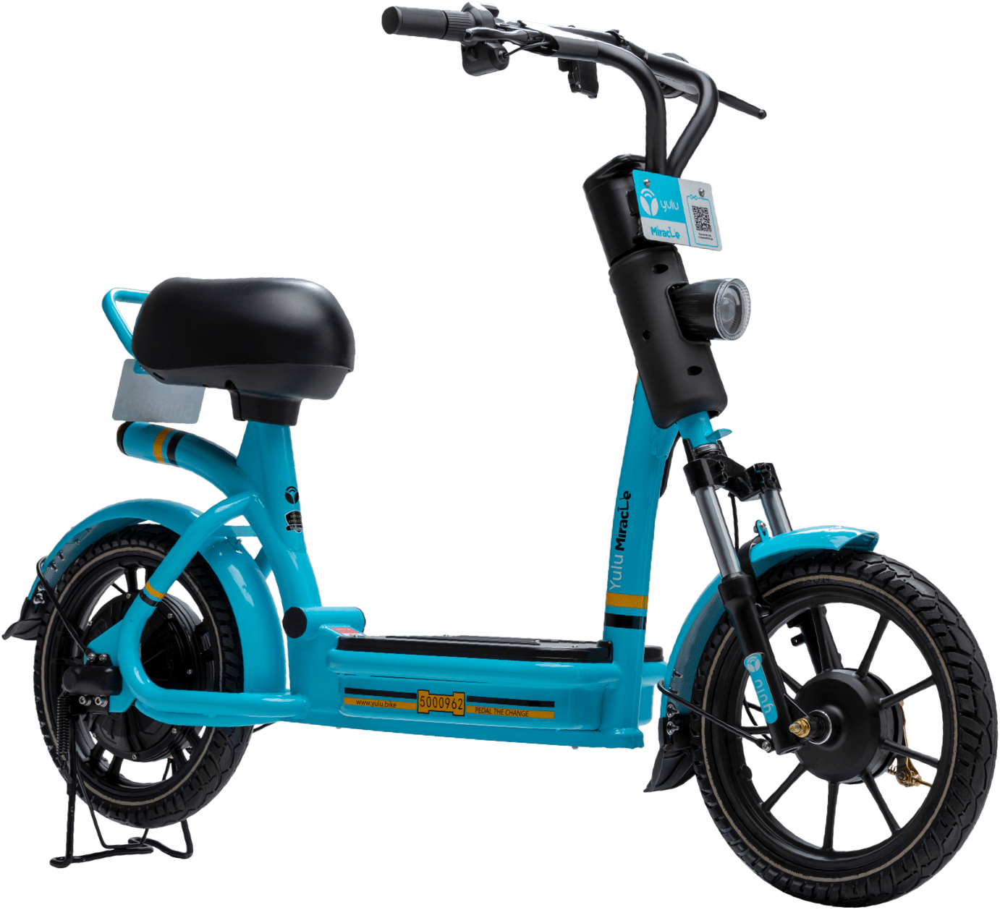

```{r setup, include=FALSE}
knitr::opts_chunk$set(echo = TRUE)
# Getting Map Data into R
library(osmdata) # Import Open Street Data
library(rnaturalearth)
library(rnaturalearthdata)

# Run this in your console first
#devtools::install_github("ropensci/rnaturalearthhires")
library(rnaturalearthhires)

# Plotting Maps
library(tidyverse) # Maps using ggplot + geom_sf
library(tmap) # Thematic Maps, static and interactive
library(osmplotr) # "Bespoke" maps in R
library(leaflet) # interactive Maps
library(threejs) # Globe maps in R. Part of the htmlwidgets family of packages
library(ggplot2)
library(ggmap)

library(RColorBrewer)

# For Spatial Data Frame Processing
library(sf)

# For combining different map plots
library(cowplot)
```


# The Situation

## Non - Existence of Workspaces


Major delivery companies encourage **flexible shift times**, making it seem like the delivery partners are responsible for the money they earn. However, the truth is, to earn a decent amount of money, delivery partners have to work for a minimum of **9 hours** effectively to make enough deliveries to reach incentives.  
  
"The charges paid to the Swiggy delivery boys are, within the nine hours 45 minutes of compulsory login, for 32 deliveries Rs 1900, 23 deliveries Rs 1200, and 16 deliveries Rs 800. Many delivery boys work till late hours to complete 32 deliveries, engaging themselves for 24 hours." (Correspondent, 2022)  
  
Now, with the increased working hours for delivery partners, their working conditions are **deplorable** because of the conditions of the Indian roads. Delivery partners **need resting area.** They have to slog continuously for deliveries out on the roads of India. With the **pollution-filled air** and the mediocre road building, many **accidents** or **health issues** are bound to exist.  
  
Delivery companies also provide a **large backpack** with a joining kit for delivery partners. These bags are usually filled and are **very heavy.** Carrying these backpacks as delivery partners ride their bikes significantly strains their back and spinal cord, which could lead to **severe long-term effects.** Guidelines like setting a **load limit** could protect the health of these workers. (Bilal, 2022)  

## Lack of Infrastructure/Benefits for Delivery Partners


"There are days in the week when Obendra Yadav, 19, is so exhausted riding his bicycle delivering food for Zomato users in Ghaziabad’s summer heat that he falls asleep without eating dinner. His wiry legs give in and the heat kills his appetite." (Matharu, 2022)  
  
Delivery partners are **not** provided with any means of transport, `fuel` for their transport, `resting` areas for agents, or `food` with subsidized rates. These facilities are usually paid for by the delivery partners **themselves,** and those who can not afford them resort to using **cheaper avenues,** such as using a bicycle, **not** because they are eco-friendly. Delivery companies **do not** provide these to their partners in the name of **'gig work'.**   
  
"...His working conditions are gruelling but Zomato gets to greenwash its image by hard selling the bicycles. Marketed as a part of ‘sustainable initiatives’, the cost of such initiatives is borne disproportionately by the gig workers and especially by those who are the poorest in the company’s food chain. They are not registered employees of Zomato and fall out of the ambit of any social security provisions of the absent state as well as the exploitative private corporations." (Matharu, 2022)  
  
Delivery partners can barely afford `meals` with the meagre **20 rupees base pay** they get per order. They can not refuse to deliver either because they are **penalized** a sum more than their earnings in a day. Such are the desperate conditions that delivery partners work under as they continue to be exploited by companies that misuse the existence of a **gig economy.** Looking after these basic needs is the minimum that companies can invest in from a `humanitarian` approach.  

# The Partnership Scheme

## Targets

Seeing all the problems indicates what companies must target to **improve** their delivery partners' **working conditions.** A few of them can be listed below:  

- Ensuring delivery partner **safety**
- Providing basic **amenities**
- Improving general delivery partner **satisfaction**  

## Approach

After gig workers formed a **constituency** to pressure the government, only recently have they been intervening to improve the conditions of these workers. They introduced a `code` on social security in 2020 that ensured various social security schemes like **Employees' State Insurance** and **Employees' Provident Fund for workers.** (Ghosh, 2021)  
  
My approach to ways companies can provide for their delivery workers is through **investing in infrastructure** for their workers. However, the amount of `capital` this would take would be too high of an investment and one that would make a **loss** for the company. Therefore, delivery companies can instead invest in **partnering up** with other companies that **already have** an infrastructure set up on a large scale.  
In the past, there have been rare cases of delivery companies setting up a few `brand partnerships` to provide for their delivery partners.

"In the partnership, Reliance BP Mobility will be building an EV ecosystem and battery swapping stations for Swiggy’s delivery partners across the country. This move is expected to lower the running cost of vehicles by 40% for Swigggy’s delivery partners and lead to higher earnings. Swiggy explored switching to electric delivery fleets with electric bikes and scooter aggregators like Zypp, Spinny, eBikeGo in 2020." (Pillai, 2021)  

# Potential Partnerships

## E-Bikes - Yulu, Zypp, Spinny



Although this has been ventured into before, Yulu has even developed E-bikes **explicitly designed for delivery partners.** The implementation of this scheme has **not** been as successful as delivery companies have not enforced this as a **guideline** that must be followed. Although companies have made the amenity available, they do not sponsor the bike costs. Therefore delivery partners who already possess bikes **do not** try to switch to another means of transport.  
  
If delivery companies provided a **designated e-bike** to each delivery partner as **part** of the `starter kit`, the change would be more widespread and impactful. Along with providing the e-bikes alone, companies must set **specific goals** to motivate delivery workers to use the same bikes. For example, suppose a delivery worker has **reduced** his `carbon footprint` by a considerable amount by switching to e-bikes. In that case, he/she must be **rewarded** with added benefits or slightly increased base pay.  
  
This solution not only helps to increase delivery partners' pay but also ensures some **safety** by placing a cap on the top speed that the e-bikes can travel, and also proves to be **eco-friendly** as it reduces the carbon footprint by a significant amount.  

## Co-working Spaces - BHIVE, WeWork, Awfis, 91Springboard


Another major overlooked issue is that delivery partners **barely** get any **rest.** They do **not** have the **time** to afford rest, nor do they have a **place** they can go. Delivery partners are always on the road in between orders or even for meal breaks. This was a problem that I wanted to address.  
  
Due to this issue, partners are often exposed to several risks:  

- `Air pollution`
- `Potential accidents`
- `Irregular meals`
- `Fatigue:` dangerous for workers that have to stay focused on the road at all times  
  
These issues could be countered by setting up **stations** or **resting zones** for delivery partners if delivery companies partnered up with other companies that **already have** an extensive **network** of workspaces. Investing in a partnership by mass renting out a portion of these workspaces exclusively for partners is a **significant upgrade** for the working conditions of the workforce.  

Amenities that the workspace must offer:  

- `Lounges` combined with a mini food court that offers food at subsidized rates
- `Sleeping pods` for workers that are fatigued or sleep deprived
- A small `infirmary` that tends to minor injuries so that primary healthcare is accessible for free  

These workspaces must be **near** delivery hotspots so that delivery partners can access them as they require. Companies could set up an **allotment scheme** that provides delivery partners with the **time slots** at which these workspaces are accessible to ensure that there is no **overcrowding** at these lounges and that everybody has a chance to enjoy the same benefits.  

# Execution

## Plotting the Maps

```{r importing data, eval = TRUE, message = FALSE, warning = FALSE, include=FALSE}
district <- st_read("Data/District/District.shp")
taluk <- st_read("Data/Taluk/Taluk.shp")
delivery <- read_csv("Data/food_data.csv")
delivery <- delivery %>% rename("Income" = "Monthly Income",
                                "MaritalStat" = "Marital Status",
                                "EduQual" = "Educational Qualifications")
workspaces <- read_csv("Data/CoworkingSpaces.csv")
```

### Order Densities and co-workspaces

```{r plotting_heatmap, eval = TRUE, message = FALSE, warning = FALSE}
map_bounds <- c(left = 77.4, bottom = 12.8, right = 77.8, top = 13.1)
Blr_Heatmap <- get_stamenmap(map_bounds, maptype = "terrain")
Blr_Heatmap <- ggmap(Blr_Heatmap, extent="device", legend="none") +
  stat_density2d(data=delivery,  
                 aes(x=longitude, y=latitude, fill=..level.., alpha=..level..), 
                 geom="polygon") +
  geom_point(data=workspaces,  aes(x=longitude, y=latitude, color = company), size = 2) +
  scale_color_viridis_d(option = "plasma") +
  scale_fill_gradientn(colours=rev(brewer.pal(7, "Spectral")))
Blr_Heatmap
```

Using the `Bangalore order delivery dataset`, I plotted a **heatmap** of the **density distribution** of orders across Bangalore to show where most of the Bangalore deliveries occur. I then plotted the **coordinates** of the various co-workspaces across the city on the same map. These coordinates were sourced from `OSMData`'s website, with which I made a small dataset containing the names and coordinates of different workspaces to plot onto the same map.  

### Bengaluru (Urban) District Plot

```{r Blr_plot, eval = TRUE, message = FALSE, warning = FALSE}
tmap_mode("view")
  
# Plot the Taluks of Bangalore (Urban) alone
blr_urban <-    
  tm_shape(taluk %>% dplyr::filter (KGISDistri == "20")) +
    tm_graticules() +
    tm_polygons(alpha = 0.9) +
    tm_text("KGISTalukN", size = 3/4) +
    
  tm_layout(legend.show = FALSE) +
  tm_credits("Geographical Boundaries are not accurate",
             size = 0.5,
             position = "right") +
  tm_compass(type = "arrow", position = c("right", "top")) +
  tm_scale_bar(position = "left") +
  tmap_style(style = "classic") 

blr_urban
```

Using `shapefiles` from the **Karnataka Geographic Information** website, I plotted the various **Taluks** in Bangalore. I combined this map with the previous one to illustrate the density distribution across the Bangalore region.  

### Combining the Maps

```{r combine_maps1, eval = TRUE, message = FALSE, warning = FALSE, include=FALSE}
tmap_mode("plot")
blr1 <- tmap_grob(blr_urban)
```

```{r combine_maps2, eval = TRUE, message = FALSE, warning = FALSE}
plot_grid(blr1, Blr_Heatmap)
```


The above illustration indicates the **intersection** between delivery hotspots and workspace hotspots. It indicates that the well-established network of co-work spaces makes quick and easy access to delivery partners possible. If the **majority** of the working crowd lies **within this intersection,** they can take turns to `rest` while maintaining `efficiency`.  
  
The `reddish-orange` bubble represents the **delivery hotspots,** while the `light blue` bubble represents the distribution of **co-workspaces.**  

## Simulated Case Studies

### Current Workflow


Currently, delivery partners just hop between different restaurants and houses **tirelessly** to reach their `incentives`, and **only** go home to take rest once they earn the desired amount for the day.

### New Proposed Workflow


In this setup, delivery partners keep **alternating** between `working` and taking `breaks`, ensuring that the **demand** is met while looking after the **needs** of the delivery partners. Both the delivery partners and the customers are **satisfied.** The `key` to making this arrangement work is that the resting zones must be located at an **optimum point** from the delivery hotspots, which, as I showed earlier, is the case.

# Citations

1. Correspondent, Dc. “Food Delivery Boy's Death Sparks Protest.” Deccan Chronicle, 15 Mar. 2022, https://www.deccanchronicle.com/nation/in-other-news/150322/food-delivery-boys-death-sparks-protest-executives-boycott-work.html#. Accessed 14 Dec. 2022.
1. Bilal, Mohammad. “Zomato and Swiggy: 4 Major Problems Food Delivery Executives Face in India.” DailyO, 6 June 2022, https://www.dailyo.in/social/zomato-and-swiggy-4-major-problems-food-delivery-executives-face-in-india-36182. Accessed 14 Dec. 2022.
1. Matharu, Sonal. “Zomato Workers Panting on Bicycles with Low Pay. but for Company, Image Matters.” ThePrint, 29 July 2022, https://theprint.in/features/zomato-workers-panting-on-bicycles-with-low-pay-but-for-company-image-matters/1057580/. Accessed 14 Dec. 2022.
1. Ghosh, Kamalika. “India's Gig Economy Mess: Is the Country Unfit for Aggregation Business?” Https://Www.outlookindia.com/, 31 Dec. 2021, https://www.outlookindia.com/website/story/business-news-indias-gig-economy-mess-is-the-country-unfit-for-aggregation-business/407481. Accessed 14 Dec. 2022.
1. Pillai, Anvita. “Swiggy Partners with Reliance, Others for EV Delivery Fleet.” Inc42 Media, Inc42 Media, 6 Aug. 2021, https://inc42.com/buzz/swiggy-partners-with-reliance-others-for-ev-delivery-fleet/#. Accessed 14 Dec. 2022.
1. Desk, Education and Careers. “Teacher Turns Zomato Delivery Boy, Delivers Food on Cycle, Twitter's Crowdfund Buys Him Bike.” News18, 13 Apr. 2022, https://www.news18.com/news/education-career/teacher-turns-zomato-delivery-boy-delivers-food-on-cycle-twitters-crowdfund-buys-him-bike-4967215.html. Accessed 14 Dec. 2022.
1. “Home.” Yulu, https://www.yulu.bike/. Accessed 14 Dec. 2022.
1. “Co-Working and Shared Office Space on Rent.” BHIVE Workspace, 12 Dec. 2022, https://bhiveworkspace.com/. Accessed 14 Dec. 2022.
1. Ksrsac. “ಕನ್ನಡ.” K, https://kgis.ksrsac.in/kgis/downloads.aspx. Accessed 14 Dec. 2022.
1. Hodler, Axel. “Creating a Heat Map from Coordinates Using R.” Medium, Medium, 20 Dec. 2018, https://axelhodler.medium.com/creating-a-heat-map-from-coordinates-using-r-780db4901075. Accessed 14 Dec. 2022.
1. Venkatadri, Arvind. “The Grammar of Maps.” Lab-06: The Grammar of Maps, 22 Apr. 2021, https://arvindvenkatadri.netlify.app/labs/r-for-artists/06-spatial/06-grammar-of-maps. Accessed 14 Dec. 2022.
1. OpenStreetMap, https://www.openstreetmap.org/#map=19/12.90358/77.60164. Accessed 14 Dec. 2022.
